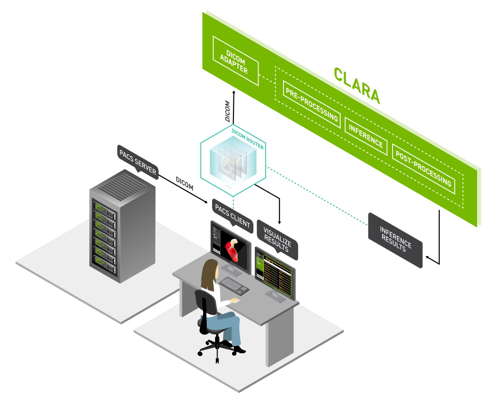

## Clara Platform Ansible Playbooks
This repository contains Ansible playbooks to install Clara Deploy Platform.

## Additional Resources to Learn More on Clara Deploy

* [NVIDIA Clara Overview Homepage](https://developer.nvidia.com/clara)
* [NVIDIA Clara Deploy SDK User Guide](https://docs.nvidia.com/clara/deploy/index.html)

### Supported Ansible versions

Clara supports using Ansible 2.9.x.
Ansible 2.10.x and newer are not currently supported.

### Supported distributions

Clara currently supports the following Linux distributions:

* NVIDIA DGX OS 4, 5
* Ubuntu 18.04 LTS, 20.04 LTS

## Getting Started

For detailed help or guidance, read through our [Getting Started Guide](ngc/overview.md) or pick one of the deployment options documented below.

## Installation Components
The Clara Ansible Playbooks will install the following components either on a remote, or a local system:
- Docker CE
- NVIDIA Docker 2
- Additional Python libraries to enable the k8s Ansible module
- Kubernetes (kubeadm, kubectl, kubelet)
- Helm v2
- NGC CLI (note: you will need an API key from [NGC](https://ngc.nvidia.com))
- Clara CLI
- Clara Helm Chart

### Kubernetes

Kubernetes (K8s) is an open-source system for automating deployment, scaling, and management of containerized applications.

For more information on Kubernetes in general, refer to the [official Kubernetes docs](https://kubernetes.io/docs/concepts/overview/what-is-kubernetes/).

## Contributing

To contribute, please issue a [signed](https://gitlab-master.nvidia.com/Clara/clara-ansible/-/blob/master/CONTRIBUtING.md#legalese) [pull request](https://help.github.com/articles/using-pull-requests/) against the master branch from a local fork. See the [contribution document](https://gitlab-master.nvidia.com/Clara/clara-ansible/-/blob/master/CONTRIBUtING.md#legalese) for more information.